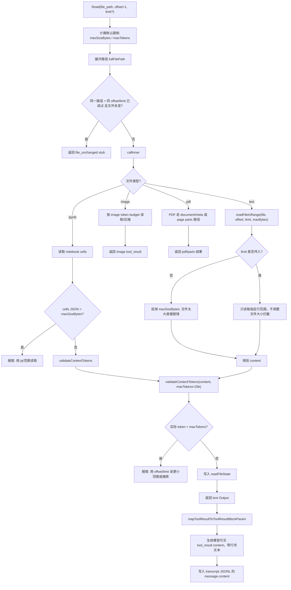
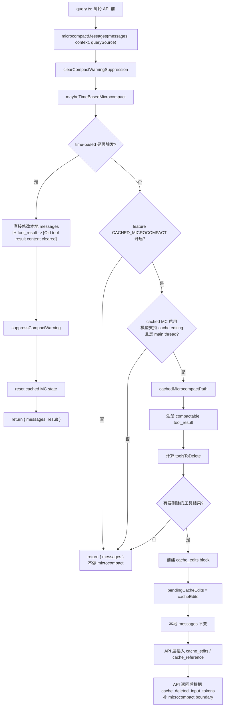

# 上下文管理

> [!NOTE]
> 本文借助CodeX辅助阅读源码，文章内容纯手工，mermaid图片为AI生成
> 
> 水平有限，仅供自己学习参考，不保证深度

关于cc的源码，网上有太多分析了，但是很多一眼AI生成，很多感觉是追热点新闻。

只要一看到是AI的端倪，我就怀有不安，内心深处总觉得不太能相信，所以我自己亲自动手看看。

虽然我也借助了AI，但是我至少让他给出每个部分的源码在哪，自己理解➕总结。

而且这部分内容我会复用，作为prompt给我自己的[Coding Agent项目](https://github.com/Iamnotphage/MT-Agent)重新设计`feature/context`分支。

光是这一个部分(上下文管理)，我就大概花了一周时间弄了个大概，以下是我的学习笔记📒产出

---

Context Management在Agent系统中极其重要，下面我将参考Claude Code泄露的源码，针对上下文管理的模块，整理学习。

## 一轮对话包含的上下文

对于这样的Coding Agent，简单来说

当用户输入消息之后，传递给LLM的消息就包含这样的结构:

```text
+ System Prompt
+ Tools
+ Messages
......
```

如果会话持续特别久，工具产生的消息和用户/AI产生的消息就会充满这个结构，直到超出Context Window

而且，就算没有超出Context Window，也可能因为Transformer的特性，导致模型注意力分散，被一些噪音污染

---

此外，考虑到后续可能会生成摘要，所以有效的上下文窗口会预留一部分(`src/services/compact/autoCompact.ts`定义的常量`MAX_OUTPUT_TOKENS_FOR_SUMMARY = 20_000`)，保证压缩正常运转


## Canonical Transcript

在详细分析压缩策略之前，先补充说明一下**Canonical Transcript**

不知道怎么翻译这个名词，权威抄本？总之这个应该是会话恢复的唯一真信息来源。

当执行会话恢复的时候，会读取这个脚本（一般是JSONL格式存储），通过里面的字段，恢复之前的会话。

JSONL文件存储了包括用户/AI/Tool等消息，这种文件根据项目名和会话id存储在`~/.claude/projects/{project_name}/{session_id}.jsonl`

每一轮对话或者执行工具，都会记录到这个cannonical transcript中

与JSONL同名的`{session_id}`这个文件夹下，还可能有`subagents`和`tool-results`文件夹

本文只针对这个transcript的内容说明一下，特别是对于工具结果，这个脚本有两个字段相关：


## 压缩策略

Claude Code采用了好几种上下文压缩策略，说实话，这部分内容，我搜了不少版本看了一下，感觉太乱了。

好多都说四种、五种压缩策略，然后每一个“四层压缩策略”里面的四个内容，每个文章还不一样！

我不敢说我这个有多么正确，我尽量参考源码给出的内容，输出自己理解的上下文管理。

参考`src/query.ts`里面的`async function* queryLoop`函数

里面基本上每个`queryCheckpoint('xxx_start')`和`queryCheckpoint('xxx_end')`包围的，就是一个模块。

我认为总的来说，应该包含这几个**模块**:

- Tool Result Budget: 处理工具结果的时候就考虑context的预算，如果结果很大，不可能一下子给LLM
- *History Snip*: 这个部分用`feature('HISTORY_SNIP')`判定执行的，实际实现未知，本文不讨论
- Microcompact: 分两种，time-based和cached，前者代码层面处理过时的工具结果；后者应该是Anthropic那边特殊的处理，也用了`feature()`包围
- *Context Collapse*: 这个部分也是`feature('CONTEXT_COLLAPSE')包围的，实际实现未知，本文不讨论
- Auto-Compact: 这个Auto-Compact模块，检测上下文压力，具体执行压缩又分为`Session Memory Compact`和`Full Compact`


### Tool Result Budget

大概就是限制工具结果的逻辑

对于工具执行产生的结果，如果工具产生的结果太大，那就得持久化它。（比如执行find或者grep产生的结果）

持久化的路径一般是`~/.claude/projects/{project_name}/{session_id}/tool-results/{tool_use_id}.txt`

Claude Code工具产生的结果的处理非常精妙，不同工具产生结果的处理策略也完全不同。

一般而言，每个工具内置声明了`maxResultSizeChars`，然后结果经过`mapToolResultToToolResultBlockParam()`处理之后，再给LLM或者前端渲染。

如果工具结果太大，前端就不会渲染具体结果。

`src/Tools.ts`对此有这样的定义:

```typescript
 mapToolResultToToolResultBlockParam(
    content: Output,
    toolUseID: string,
  ): ToolResultBlockParam
  /**
   * Optional. When omitted, the tool result renders nothing (same as returning
   * null). Omit for tools whose results are surfaced elsewhere (e.g., TodoWrite
   * updates the todo panel, not the transcript).
   */
```

---

具体来说，每个类型的工具对于结果阈值（决定是否需要持久化）如下表：

| 类别         | 工具                       | 单个结果外置阈值          |
|--------------|----------------------------|--------------------------|
| Shell 工具   | Bash, PowerShell           | 30,000 字符              |
| 搜索工具     | Grep                       | 20,000 字符              |
| 认证工具     | McpAuth                    | 10,000 字符              |
| Read 工具    | FileReadTool               | 特殊处理                 |
| 其他普通工具 | xxx                        | 50,000 字符              |

也就是说，如果单个工具产生的结果超过了这个阈值，就会将结果存储到`~/.claude/projects/{project_name}/{session_id}/tool-results/{tool_use_id}.txt`，最大保留64MB，超过会截断。

如果没单个工具超过阈值，但是同一轮多个并行执行的工具结果合并到一起，超过某个阈值（`src/constants/toolLimits.ts`定义了`MAX_TOOL_RESULTS_PER_MESSAGE_CHARS`是200K字符），就会持久化最大、最新的工具结果，JSONL额外写入标记`content-replacement metatdata`

如果单个工具没超过阈值，并且一轮工具结果合并也没超过，就保留原文到JSONL里

工具结果聚合的逻辑大概是不断聚合`tool_result`然后看是否超过200K字符，如果超过，就不断从最新的、最大结果开始外置到文件夹`tool-results`，然后JSONL的内容替换成`persisted-output preview`。其实也很复杂，本文不多赘述吧。

---

我觉得这里面最特殊的就是Read，因为如果读了一个超大文件，用同样的方法，因为超过阈值就把结果外置到`{tool_use_id}.txt`，那这个`txt`文件还是一个超大文件，根本没啥用。

所以Read工具首先对文本文件设置了默认限制`maxSizeBytes`为256KB，`maxTokens`设定为25K，并且根据函数参数，分段读取大文件。（参考`src/tools/FileReadTool/limits.ts`）

Read工具有几个参数:`file_path`, `offset`, `limit`和`pages`（`pages`用在读取pdf文件）

其中，`offset`和`limit`分别用来控制，从哪一行开始读、读多少行。如果发现前面三个参数都一样，并且文件修改时间没变，那就不需要读，直接返回`file_unchanged`。

参考: `src/tools/FileReadTool/FileReadTool.ts`

每一次读执行成功(可能是大文件分段读)之后，结果写入canonical transcript JSONL文件

也就是:

```json
{
    ...
    "message": {
        "role": "user",
        "content": [
            {
                "type": "tool_result",
                "tool_use_id": "toolu_xxx",
                "content": "101\t这是第101行\n102\t ..."
            }
        ]
    },
    ...
    "toolUseResult": {
        "type": "text",
        "file": {
            "filePath": "FileReadTool.ts",
            "content": "...这部分原文，用于前端渲染/会话恢复...",
            "numLines": 80,
            "startLine": 101,
            "totalLines": 1000
        }
    },
    ...
}
```

这两份信息都可以在JSONL找到，第一个`message.content`就是实际给大模型的，这个内容是带行号的，会进入上下文。

注意，第一个字段的`message.content`里面的工具结果是可能会被加工的，比如带行号（`cat -n`风格）、安全提醒、空输出提醒、图片的结果、被压缩之后的结果。

（比如bash工具产生的超大输出可能会被外置，然后给LLM看的内容只有`<persisted-output>`这种标记）

第二个`toolUseResult`是工具调用时的、结构化的原始结果，用来前端渲染/会话恢复，所以渲染UI的时候，基本是原始版本，不会把参杂加工版本的内容渲染。

（比如被工具消息压缩之后，关掉了CLI，然后再resume会话，UI统计渲染这个工具读了多少行，就得参考原始结果，而不是压缩之后的行数）

这里是我用GPT-5.4分析读工具执行流程之后，生成的`mermaid`流程图，描述了`Read`工具的流程:



`ipynb`、`image`和`pdf`的读取就不赘述了。

---

当然，如果文件真的很大，就算分段读，最后发给大模型仍然逼近/超过上下文窗口怎么办？

所以得启动压缩策略。

### Microcompact

在`src/services/compact/microCompact.ts`的第253行开始可以看到，微压缩分为两种路径，第一种是time-based microcompact，第二种是cached microcompact。

---

#### Time-based Microcompact

第一种是基于时间的微压缩，其实就是因为服务器那边缓存了prompt，但是prompt也是有TTL的，时间过去很久的话，这个缓存会失效。

我查了一下[deepseek](https://api-docs.deepseek.com/zh-cn/guides/kv_cache)和[qwen](https://bailian.console.aliyun.com/cn-beijing?spm=a2ty02.30268951.0.0.496274a1vuDJe6&tab=doc#/doc/?type=model&url=2862577)的API文档，都有大概说明缓存的TTL。DeepSeek文档说时间一般为几个小时到几天？Qwen说显式缓存5分钟，隐式缓存不确定。

Claude Code这部分在`src/services/compact/microCompact.ts`有设定阈值，默认是60分钟(`gapThresholdMinutes = 60`)。根据当前时间和最后一条`assistant message`的时间戳，来决定是否出触发。

假如时间过的很久，那么上一次调用的缓存大概率失效了，既然缓存失效了，下一次请求无论如何肯定要把前面的context给LLM重新计算。

既然这个开销无论如何都会产生，那就不如在发送请求之前，把旧工具的结果清除了，减少重写内容和开销。

```text
个人理解大概是这样:

A. 缓存还在
   [system + tools + history] + {新对话}: 只需要计算{新对话}
B. 缓存失效
   {system + tools + history + 新对话}: 全都要重新计算
```


这部分compact设定了白名单，只有`Read`, `Shell`, `Grep`, `Glob`, `WebSearch`, `WebFetch`, `Edit`和`Write`工具才能微压缩。

这部分工具，要么是可以通过canonical transcript中结构化的`toolUseResult`字段的参数来重新获取/复现结果；要么是信息量比较低/时效性比较强的结果。

而且，还有个参数`keepRecent = 5`设定了保留最近的5个工具的结果，只把比较旧的结果清理，也就是结果换成`[Old tool result content cleared]`。

所以如果启用了time-based microcompact，并且满足触发条件。在本轮API请求之前，即将发送给LLM的上下文里面，会把旧工具结果替换掉（不影响canonical transcript）。参考`src/query.ts`

---

#### Cached Microcompact

第二种是已经缓存的内容的压缩，这个好像是API服务端那边做的事情。

大概是，cache在API服务器还存在的时候，借助API的cache editing能力删除缓存里的旧工具结果。

这个完全是Claude Code独占，下面po一个grok expert模式的调研:


---

总的来说，Microcompact的mermaid流程图如下:



### Auto Compact

参考:`src/services/compact/autoCompact.ts`，这个文件写的真不错，挺清晰的，其实也不用分析什么了。

和前文说的一样，这里会计算有效的上下文窗口:`getEffectiveContextWindowSize(model)`

预留了`20_000`的token，用于后续摘要/压缩

有效窗口再扣除`AUTOCOMPACT_BUFFER_TOKENS = 13_000`，得到的就是Auto Compact的触发阈值`gautocompactThreshold`

然后开始判断是否需要compact，查看函数`async function shouldAutoCompact`：

他先做了几个判断，首先如果传入的参数`querySource`是`session_memory`/`compact`/*`marble_origami`*/*`tengu_cobalt_raccoon`*就返回`false`

> [!TIP]
> 这里后面两个名字挺有意思的，日语和英语混杂
> 最后一个cobalt和raccoon联合google一下居然能扯上生化危机，浣熊市是吧
> 目前意义不明，感兴趣可以看看源码

ps: `marble_origami`看注释说是上下文agent，泄露的源码里面就这里出现了，还有一处是`src/utils/analyzeContext.ts`的注释

再进一步估算当前消息的token数量，通过`calculateTokenWarningState`状态判断函数计算几个层级的阈值

看一下这个函数的定义就知道了:

```typescript
export function calculateTokenWarningState(
  tokenUsage: number,
  model: string,
): {
  percentLeft: number
  isAboveWarningThreshold: boolean
  isAboveErrorThreshold: boolean
  isAboveAutoCompactThreshold: boolean
  isAtBlockingLimit: boolean
}
```

简单理解就是当前的`tokenCount`要是超过了auto compact的阈值，那么这个`shouldAutoCompact`函数肯定返回`true`

然后这个函数最终在`autoCompactIfNeeded`这个函数被调用，这个函数总体大概流程是这样:

1. 熔断保护
   
   如果连续auto compact失败三次，就不压缩了 (三次是因为`MAX_CONSECUTIVE_AUTOCOMPACT_FAILURES`常量设定，可能是因为有些消息/输入本身就是直接超出上下文窗口了)

2. 判断触发条件

   就是调用`shouldAutoCompact`函数，检查上下文有没有达到阈值

3. 构造RecompactionInfo
   
   这部分应该是主要记录当前上下文是否是连续压缩的/上一次压缩过了多少轮对话/上一次压缩的turnID/模型auto compact阈值

4. 尝试Session Memory Compact
   
   不过这里注释写的是`EXPERIMENT: Try session memory compaction first`，不知道实际使用的时候有没有开启🤔

5. 如果Session Memroy Compact失败，调用Full Compact

   调用的是`compactConversation`函数，这里就是真正总结历史，压缩成摘要了。

6. 收尾
   
   看这个代码挺直观的

   ```typescript
   try {
    const compactionResult = await compactConversation(
      messages,
      toolUseContext,
      cacheSafeParams,
      true, // Suppress user questions for autocompact
      undefined, // No custom instructions for autocompact
      true, // isAutoCompact
      recompactionInfo,
    )

    // Reset lastSummarizedMessageId since legacy compaction replaces all messages
    // and the old message UUID will no longer exist in the new messages array
    setLastSummarizedMessageId(undefined) // 收尾1
    runPostCompactCleanup(querySource)    // 收尾2

    return {
      wasCompacted: true,
      compactionResult,
      // Reset failure count on success
      consecutiveFailures: 0,
    }
   } catch (error) ...
   ```

7. 如果full compact也失败，就是上面catch到的error处理，连续压缩失败次数加一
   
---

#### Session Memory Compact

那么具体来说，Session Memory Compact是怎么压缩的？

1. Session Memory Extraction
2. Session Memory Compact

---

首先得知道`Session Memory`这个名词的含义，其实就是由**forked agent**创建的**结构化的markdown文件**

这里涉及multi-agent的系统，但是我还不太清楚。

目前知道的是，主对话每次LLM完成回复，都会经过Post-Sampling Hook，关于是否提取session memory，有一系列判断条件。

比如，必须是主线程、开启了这个功能以及`shouldExtractMemory(messages)`函数返回真值。

这个函数判断的条件是根据当前上下文 + 上一次提取session memory增长的token数 + 工具调用次数 联合判断的:

1. session memory初始化的触发条件是当前上下文超过10K tokens
2. 初始化之后，必须达到`currentTokenCount - tokensAtLastExtraction >= 5K`
3. 要么是上一轮对话中LLM没有调用工具；要么是上一轮工具调用超过三次，就会触发提取session memory

直接看源码`src/services/SessionMemory/sessionMemory.ts`:

```typescript
  // Trigger extraction when:
  // 1. Both thresholds are met (tokens AND tool calls), OR
  // 2. No tool calls in last turn AND token threshold is met
  //    (to ensure we extract at natural conversation breaks)
  //
  // IMPORTANT: The token threshold (minimumTokensBetweenUpdate) is ALWAYS required.
  // Even if the tool call threshold is met, extraction won't happen until the
  // token threshold is also satisfied. This prevents excessive extractions.
  const shouldExtract =
    (hasMetTokenThreshold && hasMetToolCallThreshold) ||
    (hasMetTokenThreshold && !hasToolCallsInLastTurn)
  // 这里hasMetTokenThreshold是session memory已经初始化后，意思是增长超过5K tokens
```

触发之后，就会启动一个**forked agent**

这个**forked agent**在后台异步进行总结之前会话，然后生成结构化的`summary.md`

这个agent只能用文件工具，只能编辑`summary.md`，所以比较安全，然后文件在`~/.claude/projects/{project_name}/{session_id}/session-memory/summary.md`

这个文件的结构如下:

```typescript
export const DEFAULT_SESSION_MEMORY_TEMPLATE = `
# Session Title
_A short and distinctive 5-10 word descriptive title for the session. Super info dense, no filler_

# Current State
_What is actively being worked on right now? Pending tasks not yet completed. Immediate next steps._

# Task specification
_What did the user ask to build? Any design decisions or other explanatory context_

# Files and Functions
_What are the important files? In short, what do they contain and why are they relevant?_

# Workflow
_What bash commands are usually run and in what order? How to interpret their output if not obvious?_

# Errors & Corrections
_Errors encountered and how they were fixed. What did the user correct? What approaches failed and should not be tried again?_

# Codebase and System Documentation
_What are the important system components? How do they work/fit together?_

# Learnings
_What has worked well? What has not? What to avoid? Do not duplicate items from other sections_

# Key results
_If the user asked a specific output such as an answer to a question, a table, or other document, repeat the exact result here_

# Worklog
_Step by step, what was attempted, done? Very terse summary for each step_
`
```

传给这个**forked agent**的prompt是`src/srvices/SessionMemory/prompt.ts`的`getDefaultUpdatePrompt`返回的字符串。

最后这个部分完成之后，记录这次提取的tokens数、更新`lastSummarizedMessageId`（方便知道这次memory覆盖到哪条消息）

---

参考`src/services/compact/sessionMemoryCompact.ts`

> 比如，必须是主线程、开启了这个功能以及`shouldExtractMemory(messages)`函数返回真值。

前面条件都符合之后，就开始进入`async function trySessionMemoryCompaction`函数

首先检查功能是否启用，等待正在进行session memory提取的工作(可能会有后台运行的**forked agent**还没完成`summary.md`)。

接下来，首先获取更新的`lastSummarizedMessageId`以及这个session memory的内容`summary.md`

通过这个消息的uuid查找在消息内的索引`lastSummarizedIndex`；当然有一个特殊情况就是`lastSummarizedMessageId`不存在，这是因为当前会话是resume来的，这个uuid只在内存存在，新开的会话resume之后，还没有这个uuid。这种情况Index设置为最后一条消息的位置。

然后要通过这个`lastSummarizedIndex`计算`startIndex`（也就是真正开始保留消息的索引），从`startIndex`往后的消息都保留原样。

正常逻辑来说，`lastSummarizedIndex`表示的是`summary.md`能覆盖到的消息的索引，所以`startIndex`应该就是从`lastSummarizedIndex + 1`开始。

但是有很多特殊情况，需要通过`calculateMessagesToKeepIndex`来计算真正的`startIndex`(这个`startIndex`是有可能比summraized index + 1小的)

比如:

```text
index N - 1 -> xxxxx
index N     -> compact_boundary
index N + 1 -> 用户问问题
index N + 2 -> LLM回答
index N + 3 -> tool_use
index N + 4 -> tool_result <- lastSummarizedIndex
index N + 5 -> 用户追问     <- 理论上的startIndex
index N + 6 -> LLM只回答
index N + 7 -> 用户问问题2
index N + 8 -> LLM只回答2
......
```

从`[startIndex, ..., end]`后面的内容是保留区域，`startIndex`默认是在summarized index后面，但是会动态调整。

- 比如，保留区域的token数不能太小，否则就会往前扩展（startIndex减小）。默认是保留区域希望是10K tokens并且至少包含5个text block的消息（// TODO: 解释text block）

- 往前扩展的时候，往前一个下标，就计算一次token，如果保留区域的token数太大，达到大约40K tokens就停止；

- 并且，往前扩展的时候，不能超过`compact_boundary`这个标记；

- 并且，往前扩展的时候，不能把tool_use和tool_result这一对拆分开，这两个必须对应。

- 还有一种情况是LLM回答的时候分片了，多个message共享一个id，这个也不能拆开。

(参考:`src/services/compact/sessionMemoryCompact.ts`的`calculateMessagesToKeepIndex`和`adjustIndexToPreserveAPIInvariants`)

最后完成session memory compact之后，通过`buildPostCompactMessages`组装得到:

```context
[compact_boundary]
[session memory summary]
[messages to keep]
[attachments]
[hook results]
```

如果Session Memory Compact不能用，或者压缩之后，仍然超过Auto-Compact的阈值，就执行最后的压缩Full Compact

#### Full Compact

除了前面的步骤（Auto-Compact触发），还可以用户通过slash命令(`/compact [user_messages]`)主动触发。

> [!NOTE]
> 不过通过`/compact`命令，没有输入任何指示的时候，仍然会先尝试Session Memory Compact；如果带有指示，就会直接进入Full Compact
> 参考`src/commands/compact/compact.ts`

下面参考`src/services/compact/compact.ts`分析

主要是`async function compactConversation`这个函数

除了一开始的前置检查+token估算，就是执行`PreCompact Hooks`，这个函数第一个参数内就包含了判断是`auto | manual`

```typescript
const hookResult = await executePreCompactHooks(
  {
    trigger: isAutoCompact ? 'auto' : 'manual',
    customInstructions: customInstructions ?? null,
  },
  ...
) // 这个地方，如果是/compact触发的，参数customInstrcutions就不会是null
// 如果是自动触发，这个地方就是null
```

后续针对这个`hookResult`，会合并`instructions`

这部分其实就是额外补充一下compact的prompt

然后开始构造compact prompt

```txt
compact prompt大概如下:

[NO_TOOLS_PREAMBLE]: 简单来说就是禁止调用工具以及用特定的 <analysis> block和<summary> block
[BASE_COMPACT_PROMPT]: 要求结构化的压缩信息
[Additional Instructions]
[NO_TOOLS_TRAILER]: 再次强调不要调用工具以及用特定的 <analysis> block和<summary> block
```

然后这个`compactPrompt`封装用户消息，变量名`summaryRequest`，作为参数传给`streamCompactSummary()`函数(真正的核心部分)

```typescript
summaryResponse = await streamCompactSummary({
  messages: messagesToSummarize, // compactConversation的参数，在auto-compact那里传进来的
  summaryRequest,                // compact prompt包装的用户消息
  appState,                      // 
  context,                       // ToolUseContext
  preCompactTokenCount,          // token统计
  cacheSafeParams: retryCacheSafeParams,
}) // 这个函数内部实现，也是异步调用`runForkedAgent()`

summary = getAssistantMessageText(summaryResponse) // 提取文本
```

这个`summary`就是最终的压缩结果，这个大概是:

```text
<analysis>
...
</analysis>

<summary> # 结构化摘要 每个section固定
1. Primary Request and Intent:
2. xxx
# 完整模版查阅`src/services/compact/prompt.ts`的BASE_COMPACT_PROMPT
</summary>
```

---

后续还有针对`summary`更健壮的处理，有几种情况:

1. 带有PTL标记: （Prompt Too Long）会把旧消息裁剪(`truncateHeadForPTLRetry`)，再重试
2. 不带PTL标记: 退出死循环，检查是否为空，空的话直接抛出错误；检查是否带有`api error`前缀，同样抛出错误

---

然后就是考虑把旧的状态存储一下、缓存清除；然后把新的summary替换原来的旧历史

首先是清理压缩之前的`context.readFileState`，清理之前先保存；这部分还跟工具缓存有点关系，太复杂了，建议看源码。

其次，再对压缩进行一些后处理

因为压缩之后清理了一些状态，这里要补充一些关键的状态，比如:

- 前面保存的`readFileState`
- 压缩后需要重新注入的运行时状态
- plan和plan模式的一些指示
- 调用涉及的skill相关的
- deferred/agent/MCP相关的

这些状态都通过`postCompactFileAttachments.push()`补充。

然后才执行SessionStart hooks: 收集这些hooks返回的消息，最后追加到最终的上下文

---

然后再创建`compact boundary`标记，用来作文新的上下文的起点

封装summary成用户消息；记录压缩前后的大小、统计压缩后到token、判断是否下一轮再次压缩；

最终Full Compact完成后，得到的消息大概如下:

```text
[compact boundary]
[summary messages]
[attachments]
[hook results]
```

最后这组值，加上一些token、usage和`userDisplayMessage`返回给auto-compact

再交给`query.ts`通过`buildPostCompactMessages()`组装压缩后的消息，把当前的messages替换成上述这份新的上下文


## 杂项

### apiMicrocompact.ts

这个文件名感觉有点误导，但是实际上做的事情只有构造请求体好像🤔

### Reactive Compact

这个应该算是错误处理的一部分，泄露的源码好像也没有出现实现的细节。

参考`src/query.ts`的1119行，还有`src/commands/compact/compact.ts`

多个文件提及`reactiveCompact.ts`但是泄露的源码似乎没有这个文件

### Partial Compact

部分压缩？这部分也是一样

在`src/services/compact/compact.ts`能找到`partialCompactConversation`函数（看了一下和full compact一样都是调用`streamCompactSummary()`函数，后台agent生产结构化摘要）

流程和Full Compact很相似，先决定压缩/保留区域，构造prompt，生成summary，生成attachments，执行sessionStart hooks和创建compact boundary再包装成message

最终可能是这样的:

```
[compact boundary]
[partial compact summary]
[messagesToKeep]: 有点像session memory compact保留区域
[attachments]
[hookResults]
```

但是这个函数，从泄露的代码来看，只有`src/screens/REPL.tsx`调用了它，更像是前端交互层的功能。

简单google一下，发现官方repo有不少issue关于这个，比如[issue#26488](https://github.com/anthropics/claude-code/issues/26488)

从源码来看，在claude code的CLI页面，双击esc会弹出一个rewind，选中消息之后，有一个选项是`Summarize from here`

也就是我们用户自己主动选择范围触发的partial compact

这个触发之后，UI会渲染一个`Summarized conversation`，如果你`ctrl + o`展开的话:

```text
⏺ Summarized conversation
    ⎿  This session is being continued from a previous conversation that ran out of context. The summary below covers the earlier portion of the conversation.`

    Summary:
    1. Primary Request and Intent:
       xxxx
    2. Key Technical Concepts:
       xxxx
    3. Files and Code Sections:
       xxxx
    4. Errors and fixes:
       xxxx
    5. Problem Solving:
       xxxx
    6. All user messages:
       xxxx
    7. Pending Tasks:
       xxxx
    8. Current Work:
       xxxx
    9. Optional Next Step:

    If you need specific details from before compaction (like exact code snippets, error messages, or content you generated), read the full transcript at:
    /Users/chen/.claude/projects/{project_name}/{session_id}.jsonl
```

能看见很明显的结构化的markdown格式，并且最后给出了canonical transcript的路径，这一点和Full Compact几乎一样(`src/services/compact/prompt.ts`的`BASE_COMPACT_PROMPT`和`PARTIAL_COMPACT_PROMPT`)。

## 感悟

真的复杂，而且这还只是冰山一角，似乎有好多内容是这份源码没有逆向到的。

之前还经常有人说agent不过是prompt engineering，但是我看了这个内容，太复杂了......

这不是简单的一句prompt工程就能构造出来的

这里面还有很多我不知道的，比如hooks系统、工具系统、MCP、Multi-Agents等等等等

而且，API服务器那边，还有KV Cache、服务端怎么处理过时的消息的......

直接晕了😵‍💫

